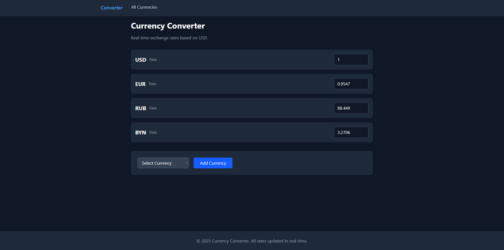
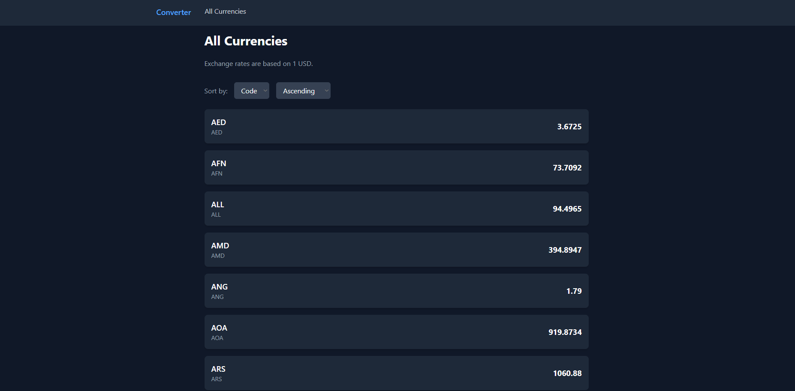

# Currency Converter Frontend

This is the frontend for the **Currency Converter** application. It allows users to convert amounts between currencies in real-time and view a list of all available currencies.

## Tech Stack

- **Language**: TypeScript
- **Framework**: React.js
- **Build Tool**: Vite
- **Styling**: Tailwind CSS
- **State Management**: Redux Toolkit
- **API Client**: Axios
- **Routing**: React Router

## Features

- Display a list of default currencies (USD, EUR, RUB, BYN).
- Add any currencies from the list.
- Convert amounts between currencies in real-time.
- View a list of all currencies with their exchange rates.
- Sort currencies by code or rate.

## Running the Frontend

### Prerequisites

1. **Node.js**: Ensure you have Node.js installed (v16 or higher).
2. **Backend**: Ensure the backend server is running.

### Installation

1. **Clone the repository**:
   ```bash
   git clone https://github.com/your-repo/currency-converter-frontend.git
   cd currency-converter-frontend
   ```
2. **Install dependencies**: npm install
3. **Start the development server**: npm run dev
4. **Create .env in the root directory with the following variable**:
   VITE_API_URL="Replace with your backend URL"

## Live Demo

1. **Frontend**: https://currency-converter-frontend-three.vercel.app



